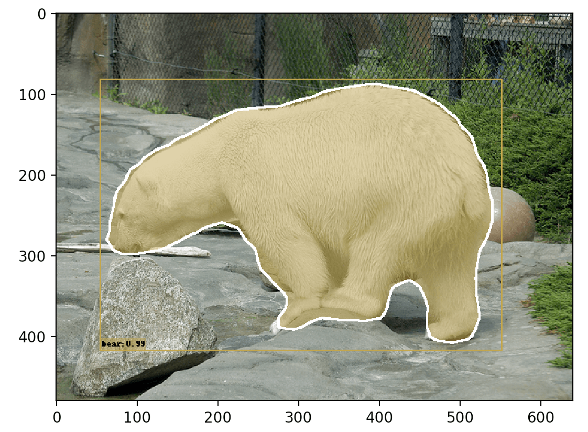

# Vizer
Boxes and masks visualization tools.

## Install

```bash
pip install Vizer
```
## Usage
```python
img = Image.open(path)
# draw masks
img = draw_masks(img, data['masks'], data['labels'])
# draw boxes
img = draw_boxes(img, boxes=data['boxes'], labels=data['labels'], scores=data['scores'])
# show
plt.imshow(img)
plt.show()
```

## Example

